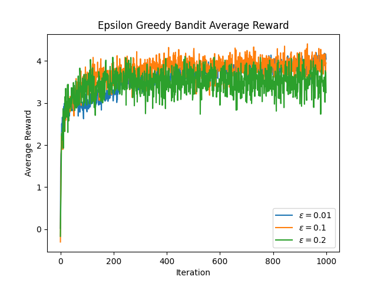
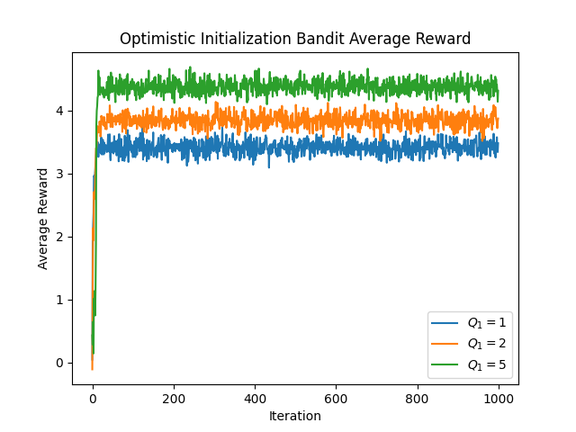
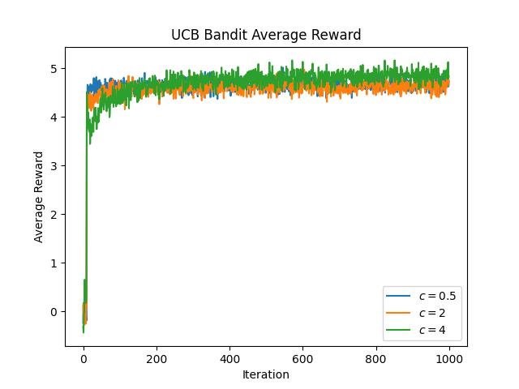
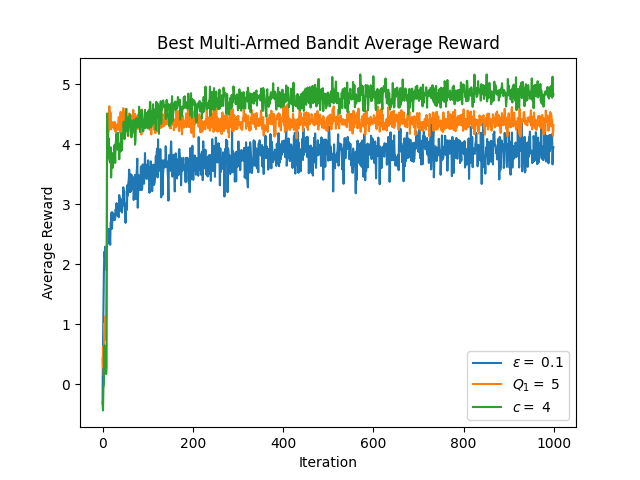

# Multi-Armed-Bandits
A python implementation of the multi-armed bandit problem using reinforcement learning. The repo contains implementations of the epsilon greedy, optimistic initialization and upper confidence bound (UCB) methods.

Each of the methods balance exploration and exploitation of the arms of the multi-armed bandit through selecting actions differently. For all three methods the Q-values of the arms are calculated as follows:

$$ Q_{n+1} = Q_n + \alpha(R_n - Q_n) $$
$$ where~~\alpha = (1/n) $$

## Implementations

### Epsilon Greedy
The epsilon greedy algorithm is a simple yet effective strategy for exploring and exploiting the arms of the multi-armed bandit. It chooses the arm with the highest estimated reward with probability (1 - epsilon), and a random arm with probability epsilon. This allows the algorithm to explore new arms while still exploiting the currently known best arm.

$$ A \leftarrow
\left\{
\begin{array}{l}
    argmax_{a} Q(a)~~~~with~probability~~1-\epsilon \\
    random~action~~~~with~probability~~\epsilon \\
\end{array}
\right. 
$$

### Optimistic Initialization
The optimistic initialization algorithm initializes the estimated rewards for each arm to a high value (Q1), encouraging exploration of all arms initially. As the algorithm progresses and collects more data, the estimated rewards converge to their true values, and the algorithm begins to exploit the best arm more frequently.

$$ Q_{1} > 0 $$

Note: $$\epsilon = 0$$ in this implementation but can be set to a value between $$[ 0 , 1)$$

### Upper Confidence Bound (UCB)
The UCB algorithm balances exploration and exploitation by computing an upper confidence bound for each arm's estimated reward. It selects the arm with the highest upper confidence bound, which encourages exploration of arms with high uncertainty while still exploiting arms with high estimated rewards.

$$ A_{t} = argmax_{a}\left[Q_{t}(a) + c \sqrt{\frac{ln(t)}{N_t(a)}}\right] $$

## Requirements
This project requires Python 3.10 or higher.

## How to use:

1. Clone the repository:

```bash
git clone https://github.com/nicholasbaard/Multi-Armed-Bandits.git
```

2. Install the required dependencies:

```bash
pip install requirements.txt
```

3. Run the main script:
This script will run the bandit algorithms:
- Epsilon Greedy
- Optimistic Initialization
- Upper Confidence Bound (UCB)

for the specified number of iterations and average over the specified number of runs. The average reward over time for each algorithm are plotted and saved in the "plots" folder.
The script will also take the best bandit from each algorithm and plot the average reward over time for each arm.

```bash
cd src
python main.py
```
## Arguments
    
    - `--num_iterations`: Number of iterations to run the bandit algorithms (default: 1000)
    - `--num_runs`: Number of runs to average over (default: 100) 
    - `--num_arms`: Number of arms in the bandit (default: 10)
    - `--mu`: Mean of the normal distribution (default: 0)
    - `--var`: Variance of the normal distribution (default: 3)
    - `--show_plot`: Whether to show the plot or not (default: False)
    - `--eps`: Epsilon values for the Epsilon Greedy Bandit algorithm (default: [0.01, 0.1, 0.2])
    - `--Qs`: Q1 values for the Optimistic Greedy Bandit algorithm (default: [1, 2, 5])
    - `--c`: c values for the UCB Bandit algorithm (default: [0.5, 2, 4])


# Results
This repository includes plots generated during the experiments using the default parameters. The plots can be found in the `plots` folder.

## Epsilon Greedy:


## Optimistic Initialization:


## Upper Confidence Bound:


## Comparison of the best bandit from each algorithm:


## Contributing

Contributions are welcome! If you find any issues or have suggestions for improvements, please open an issue or submit a pull request.